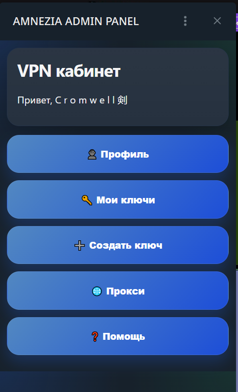
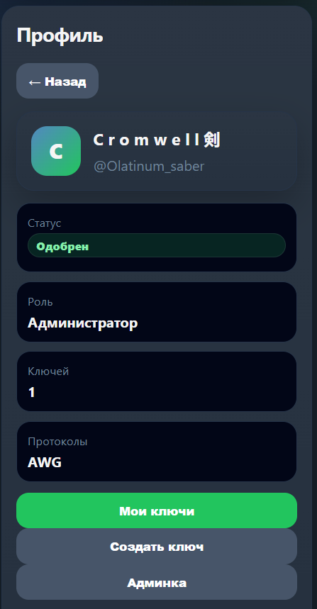
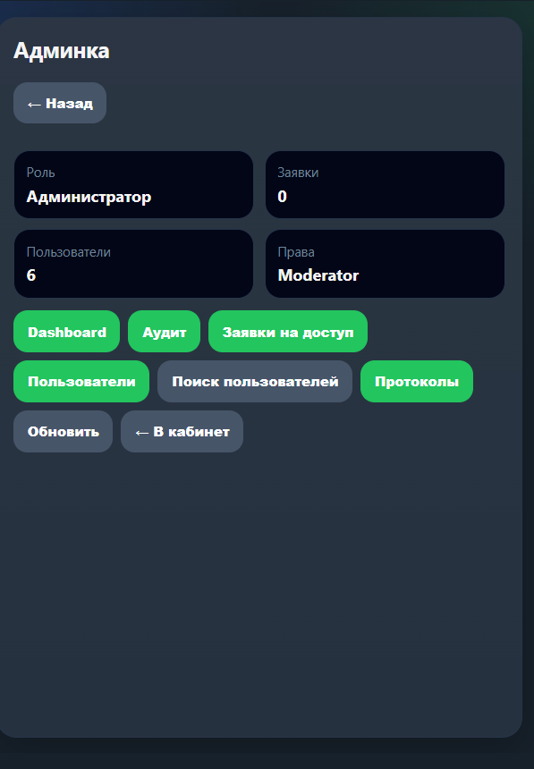
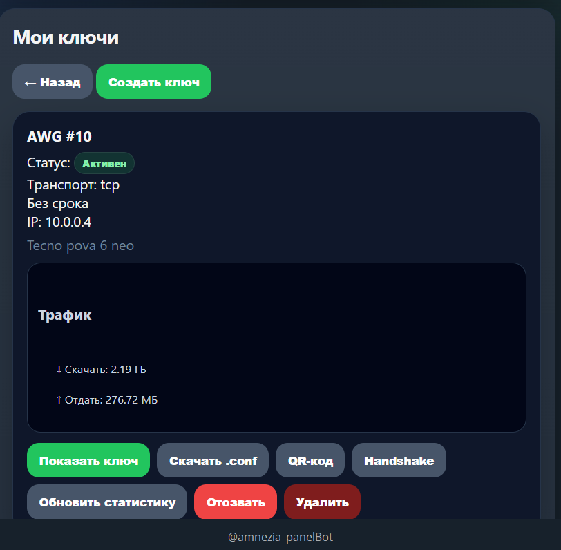
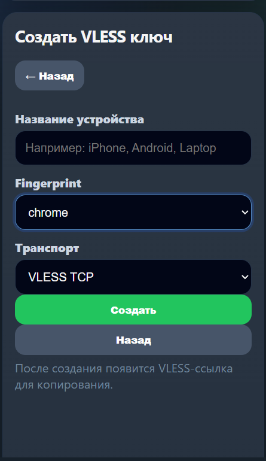

# 🛡️ VPN Telegram WebApp Bot


Telegram-бот и Telegram WebApp-панель для управления self-hosted VPN на Ubuntu VDS. Бот управляет пользователями, заявками на доступ, ключами Xray VLESS Reality и AmneziaWG, а также предоставляет удобный интерфейс для работы с Proxy и полноценную Админ-панель.

Проект рассчитан на развёртывание на одном сервере **без** Docker, Redis, PostgreSQL или тяжелых ORM.

---

## 📸 Интерфейс WebApp

Полнофункциональный и интуитивно понятный графический интерфейс прямо в мессенджере. Управляйте своим VPN, прокси и пользователями без лишних сложностей.

<p align="center">
  
  
  
</p>
<p align="center">
  
  
</p>

> **Примечание:** Положите ваши скриншоты в папку `images` в корне репозитория и назовите их соответственно (например, `admin_panel.png`, `main_menu.png` и т.д.), либо обновите пути в файле README.

---

## ✨ Возможности

* 👥 **Регистрация пользователей** и процесс одобрения заявок на доступ через Telegram.
* 📱 **Telegram WebApp-кабинет** — полноценный графический интерфейс прямо в мессенджере.
* 🛠️ **Админ-панель** (Dashboard, Аудит, управление заявками и пользователями). Полный контроль над доступом прямо в Telegram.
* ⚡ **Xray VLESS Reality**: создание ключей, выбор Fingerprint и транспорта, доставка конфигов, отзыв, удаление и сверка состояния при запуске.
* 🌐 **AmneziaWG**: создание ключей с настройкой MTU, доставка клиентских конфигов, QR-коды, статистика трафика (Скачано/Отдано), отзыв, удаление.
* 🧦 **Отдельный раздел «Прокси»** для автоматической выдачи доступов SOCKS5/Dante и Telegram MTProto Proxy.
* 🚀 **Опциональный модуль маршрутизации WARP для Telegram**: серверный туннель AmneziaWG (`tg-warp`) с автоматическим переключением на прямой доступ при сбоях.
* 🔒 **MTProto Proxy**: поддержка статического режима и управляемого режима (managed) с индивидуальными секретами для пользователей.
* 🛡️ **Проверка прав**: пользователи видят только свои конфиги и статистику. Деструктивные действия доступны **только администраторам**.
* 📋 **Журнал аудита** с рекурсивным маскированием чувствительных данных.

---

## 🛠️ Стек технологий

* **Python 3.12** (3.12.x)
* **aiogram 3**
* **SQLite** (через aiosqlite)
* **systemd**
* **Xray VLESS Reality**
* **AmneziaWG** / утилиты, совместимые с WireGuard

---

## 📂 Структура репозитория

```text
main.py                    # Точка входа бота
init_db.py                 # Скрипт инициализации и миграций схемы SQLite
requirements.txt           # Зависимости среды выполнения
db/schema.sql              # Схема базы данных
deploy/vpn-bot.service     # Шаблон systemd-юнита
bot/                       # Telegram-обработчики, клавиатуры, FSM, форматирование
webapp/                    # aiohttp WebApp backend/API и статика (HTML/CSS/JS)
services/                  # Бизнес-логика и проверка прав
repositories/              # Слой доступа к SQLite
adapters/                  # Адаптеры для Xray, AWG, systemctl, бэкапов, shell
config/settings.py         # Парсинг и валидация переменных окружения

```

---

## ⚠️ Предупреждение о безопасности

Этот проект обрабатывает операционные секреты VPN и Telegram. **Никогда не коммитьте и не публикуйте:**

* Файлы `.env` и токены Telegram-ботов.
* Приватные ключи (Private keys) или Preshared keys.
* Базы данных SQLite или их дампы.

> 💡 **Рекомендация для BotFather:** Отключите возможность добавления бота в группы. Бот предназначен для работы только в личных сообщениях.

---

## ⚙️ Переменные окружения

Скопируйте `.env.example` в `.env` и замените плейсхолдеры на ваши значения. `BOT_TOKEN` и `ADMIN_IDS` обязательны для запуска.

```env
BOT_TOKEN=<telegram_bot_token>
ADMIN_IDS=<telegram_user_id>

DB_PATH=/opt/vpn-service/data/vpn.db
LOG_DIR=/opt/vpn-service/logs

WEBAPP_URL=[https://your-domain.example:8443/](https://your-domain.example:8443/)
WEBAPP_HOST=127.0.0.1
WEBAPP_PORT=8088

# Настройки Xray (Режим Root+api)
XRAY_APPLY_MODE=api
XRAY_CONFIG_PATH=/usr/local/etc/xray/config.json
XRAY_INBOUND_TAG=vless-in
XRAY_PUBLIC_HOST=<vpn_public_host>
XRAY_PUBLIC_PORT=443
XRAY_REALITY_PUBLIC_KEY=<xray_reality_public_key>
XRAY_SNI=<xray_reality_sni>
XRAY_SHORT_ID=<xray_short_id>
XRAY_STATS_SERVER=127.0.0.1:10085

# Настройки AmneziaWG
AWG_CONFIG_PATH=/etc/amnezia/amneziawg/awg0.conf
AWG_INTERFACE=awg0
AWG_SERVER_ADDRESS=10.0.0.1
AWG_ENDPOINT_HOST=<awg_endpoint_host>
AWG_ENDPOINT_PORT=<awg_endpoint_port>
AWG_SERVER_PUBLIC_KEY=<awg_server_public_key>

```

---

## 🚀 Быстрая установка и Деплой

### 1. Подготовка и клонирование

```bash
sudo install -o root -g root -m 0755 -d /opt/vpn-service
sudo git clone [https://github.com/Egor051/vpnbot.git](https://github.com/Egor051/vpnbot.git) /opt/vpn-service
cd /opt/vpn-service

sudo python3.12 -m venv .venv
sudo /opt/vpn-service/.venv/bin/pip install --upgrade pip
sudo /opt/vpn-service/.venv/bin/pip install -r requirements.txt -c constraints.txt

```

### 2. Конфигурация

```bash
sudo install -o root -g root -m 0700 -d /opt/vpn-service/data /opt/vpn-service/logs
sudo install -o root -g root -m 0600 .env.example .env
sudo nano .env

```

### 3. Запуск сервиса

```bash
python deploy/check-nonroot-helper-mode.py
sudo cp deploy/vpn-bot.service /etc/systemd/system/vpn-bot.service
sudo systemctl daemon-reload
sudo systemctl enable --now vpn-bot

```

### 4. Обновление бота

```bash
cd /opt/vpn-service
sudo git pull --ff-only
sudo /opt/vpn-service/.venv/bin/pip install -r requirements.txt -c constraints.txt
sudo systemctl restart vpn-bot

```

---

## 🔧 Troubleshooting и Диагностика

Если что-то пошло не так, в админ-панели есть раздел **Диагностика backend**, который покажет статус сервисов (OK / DEGRADED).

**Полезные команды для проверки:**

* Статус бота: `sudo systemctl status vpn-bot --no-pager`
* Логи бота: `sudo journalctl -u vpn-bot -n 100 --no-pager`
* Проверка портов: `sudo ss -tulnp | grep -E ':443|:8443|:9444|:8088'`

---

## 📜 Лицензия

Проект распространяется под лицензией MIT. Подробности смотрите в файле [LICENSE](https://www.google.com/search?q=LICENSE).

```

```
